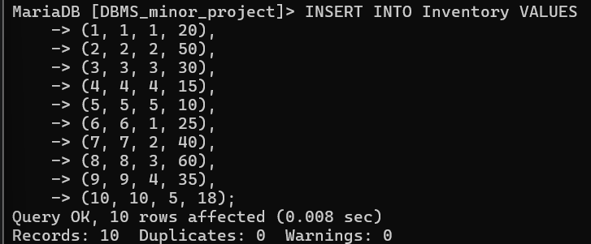
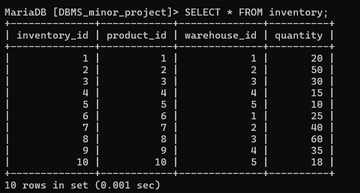

# insert values in data of inventory

INSERT INTO Inventory VALUES
(1, 1, 1, 20),
(2, 2, 2, 50),
(3, 3, 3, 30),
(4, 4, 4, 15),
(5, 5, 5, 10),
(6, 6, 1, 25),
(7, 7, 2, 40),
(8, 8, 3, 60),
(9, 9, 4, 35),
(10, 10, 5, 18);

# show values inserted in inventory data

select* from inventory;

