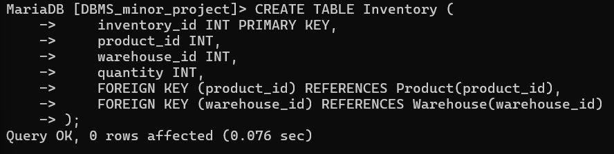
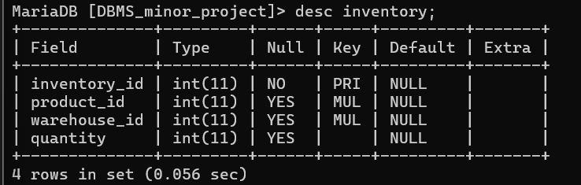

# main table of er inventory table
CREATE TABLE Inventory (
    inventory_id INT PRIMARY KEY,
    product_id INT,
    warehouse_id INT,
    quantity INT,
    FOREIGN KEY (product_id) REFERENCES Product(product_id),
    FOREIGN KEY (warehouse_id) REFERENCES Warehouse(warehouse_id)
);

# describe inventory table

desc inventory;

