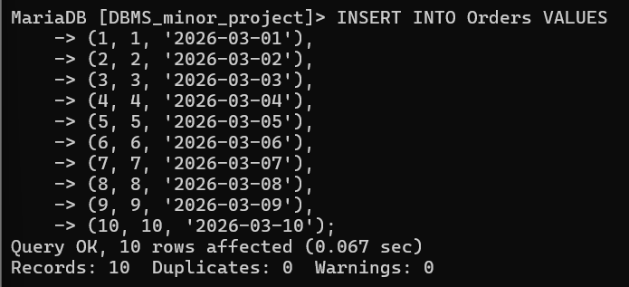
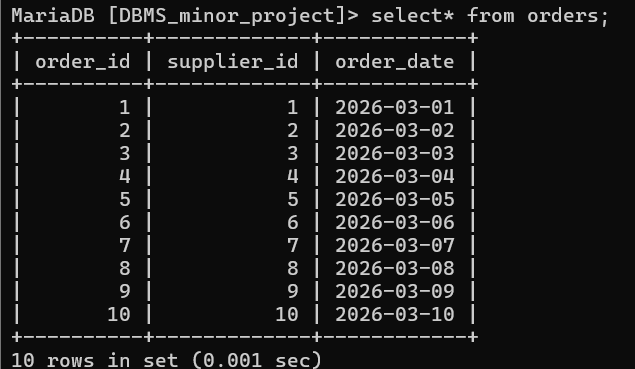

# insert values on  orders table

INSERT INTO Orders VALUES
(1, 1, '2026-03-01'),
(2, 2, '2026-03-02'),
(3, 3, '2026-03-03'),
(4, 4, '2026-03-04'),
(5, 5, '2026-03-05'),
(6, 6, '2026-03-06'),
(7, 7, '2026-03-07'),
(8, 8, '2026-03-08'),
(9, 9, '2026-03-09'),
(10, 10, '2026-03-10');

# show orders table

select * from orders;

