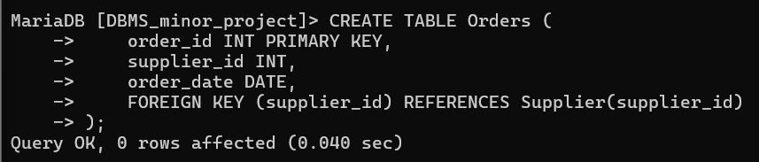
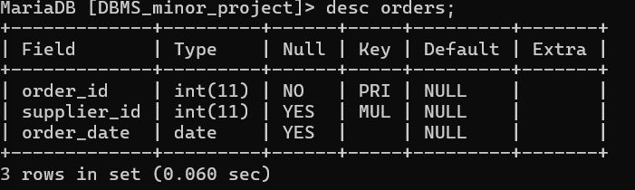

# cretae orders tables
CREATE TABLE Orders (
    order_id INT PRIMARY KEY,
    supplier_id INT,
    order_date DATE,
    FOREIGN KEY (supplier_id) REFERENCES Supplier(supplier_id)
);

# describe orders table

desc orders;

