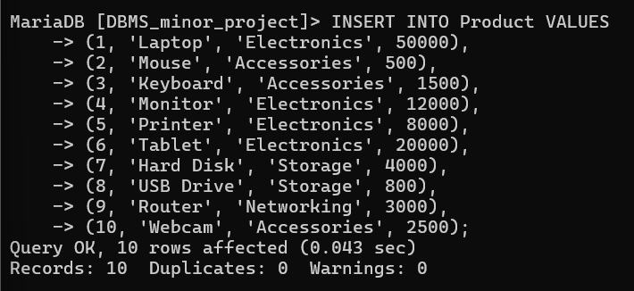
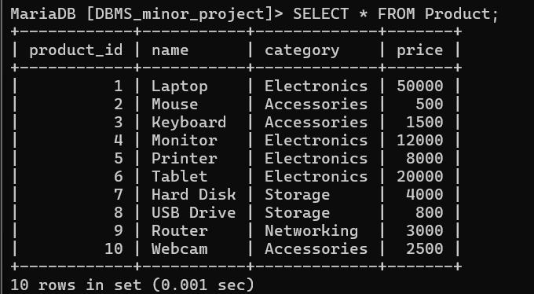

# inser sample values for product

INSERT INTO Product VALUES
(1, 'Laptop', 'Electronics', 50000),
(2, 'Mouse', 'Accessories', 500),
(3, 'Keyboard', 'Accessories', 1500),
(4, 'Monitor', 'Electronics', 12000),
(5, 'Printer', 'Electronics', 8000),
(6, 'Tablet', 'Electronics', 20000),
(7, 'Hard Disk', 'Storage', 4000),
(8, 'USB Drive', 'Storage', 800),
(9, 'Router', 'Networking', 3000),
(10, 'Webcam', 'Accessories', 2500);

# show values in product table

select* from product;

