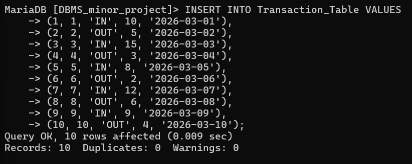
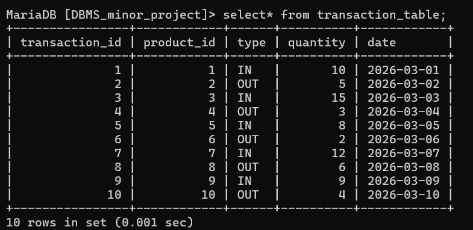

# insert values in transaction table 

INSERT INTO Transaction_Table VALUES
(1, 1, 'IN', 10, '2026-03-01'),
(2, 2, 'OUT', 5, '2026-03-02'),
(3, 3, 'IN', 15, '2026-03-03'),
(4, 4, 'OUT', 3, '2026-03-04'),
(5, 5, 'IN', 8, '2026-03-05'),
(6, 6, 'OUT', 2, '2026-03-06'),
(7, 7, 'IN', 12, '2026-03-07'),
(8, 8, 'OUT', 6, '2026-03-08'),
(9, 9, 'IN', 9, '2026-03-09'),
(10, 10, 'OUT', 4, '2026-03-10');

# show values of transaction table 

select * from transaction_table;

