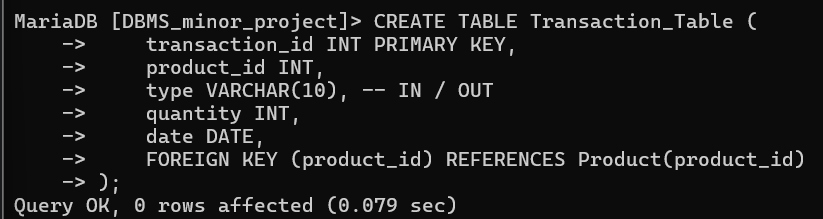
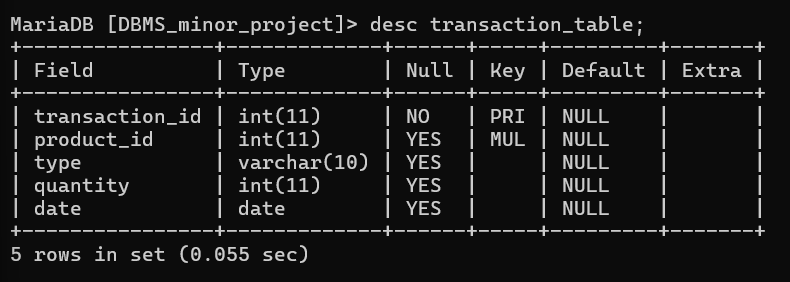

# create transction_table 

CREATE TABLE Transaction_Table (
    transaction_id INT PRIMARY KEY,
    product_id INT,
    type VARCHAR(10), -- IN / OUT
    quantity INT,
    date DATE,
    FOREIGN KEY (product_id) REFERENCES Product(product_id)
);

# describe the transcation table

desc transaction_table;

