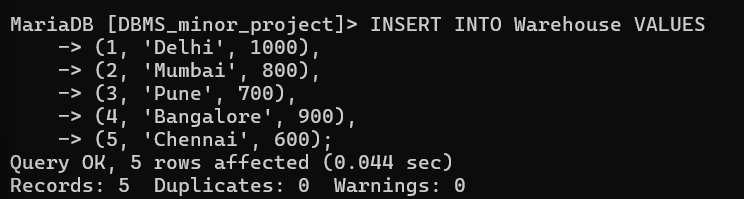
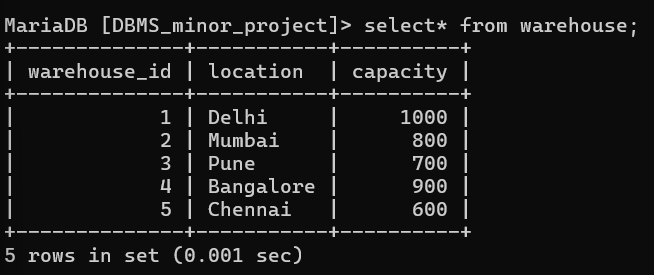

# insert sample values for waarehouse data

INSERT INTO Warehouse VALUES
(1, 'Delhi', 1000),
(2, 'Mumbai', 800),
(3, 'Pune', 700),
(4, 'Bangalore', 900),
(5, 'Chennai', 600);

# show values in warehouse;

select* from warehouse;

